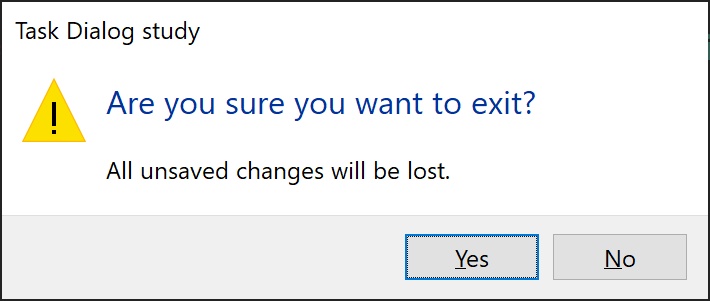
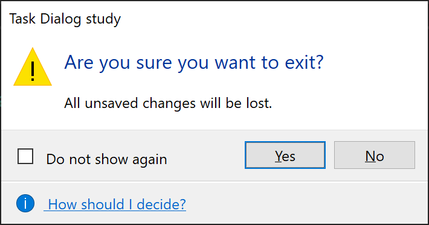
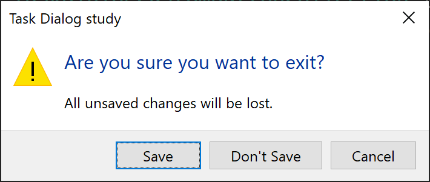
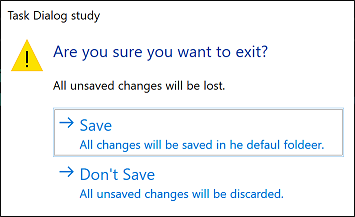
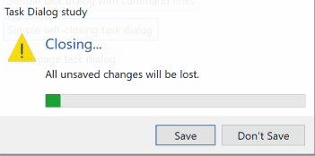

# Windows Forms TaskDialog useability study primer

The example is used to assert quality, clarity and useability of the TaskDialog API.

## Exercises

1. Create a simple task dialog

    

2. Create a simple task dialog with custom buttons

    

3. Create a simple task dialog with 
    * a custom content,
    * a verification text, and
    * a footer with a help link (e.g. go to https://dot.net/)

    

4. Create a task dialog with command link buttons

    

5. Create a simple self-closing task dialog with a progress bar
    
    

6. Implement a multi page task dialog:
	* "Yes" button is enabled after checkbox is checked
	* Progress bar initialises as marquee for few seconds, then runs from 0 to 100%,
    * Show results command link button

    